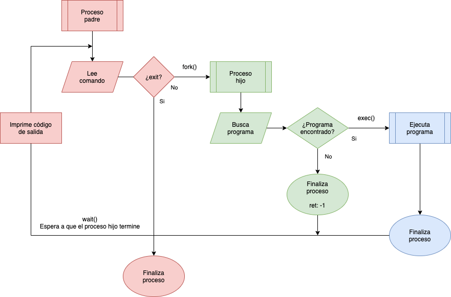

---
# https://www.mkdocs.org/user-guide/writing-your-docs/#meta-data
title: Intérprete de comandos
authors:
- Andrés Leonardo Hernández Bermúdez
---

# Intérprete de comandos (shell) en C

Práctica 3

## Objetivo

- Familiarizar al alumno con la creación de subprocesos y la ejecución de otros programas utilizando las llamadas al sistema `fork(2)` y `exec(2)`
- Crear un intérprete de comandos básico que utilice subprocesos

--------------------------------------------------------------------------------

## Lineamientos

Escribir un progrma en C que cumpla con los siguientes requisitos:

- Funcione como un intérprete de comandos
    - Establecer la variable de entorno `PATH` como `/bin:/usr/bin` en el arreglo `envp` al iniciar el intérprete
    - El _prompt_ es `#` si el usuario es `root` o `%` en caso contrario
- El proceso padre lee los comandos desde `STDIN` o desde un archivo de entrada que se especifica en el primer argumento
- Cuando se escribe un comando
    - Se crea un subproceso que busca el ejecutable en los directorios `/bin` y `/usr/bin`
        - El proceso padre debe esperar que termine el proceso hijo antes de leer otro comando
    - Si el nombre del comando no se encuentra, el subproceso imprime un mensaje de error a `STDERR` y finaliza
    - Si el nombre del comando es encontrado, se manda a llamar a `exec(2)` para que el subproceso ejecute el comando
        - Se deben pasar los argumentos proporcionados al programa invocado
        - Se deben pasar las variables de entorno actuales al programa invocado
- Al finalizar imprimir el código de salida del último programa invocado o `-1` si el programa no fue encontrado
- Implementar el comando `exit` que finaliza el intérprete (proceso padre y todos los procesos hijos)
    - Si los comandos se leen desde archivo y se llega al fin de archivo, el intérprete debe de finalizar su ejecución

Existen un ejemplo de código fuente para la función [`waitpid(3)`][waitpid-c]

### Diagrama de funcionamiento

|  |
|:------------------:|
| Diagrama de funcionamiento del programa _shell_ |

### Extra

- Implementar la opción de depuración con el argumento `-d` / `--debug` que imprima mensajes adicionales
    - PID del proceso padre e hijo (después de llamar a `fork(2)`)
    - Cuando se busca el programa en cada uno de los directorios de `PATH`
    - Imprimir la línea de comandos antes de llamar a `exec(2)`
- Buscar el programa ejecutable en todos los directorios que tenga la variable de entorno `PATH`
    - El separador de cada directorio es `:`
- Implementar el comando `export` para crear nuevas variables de entorno o modificar las existentes
- Implementar el comando `unset` para borrar alguna variable de entorno existente

--------------------------------------------------------------------------------

## Recomendaciones

- Establecer un búfer de tamaño conocido para leer los comandos (ej, 256 caracteres)
- Para los comandos con argumentos se puede utilizar `strtok(3)`, `strstr(3)` o alguna función similar para separar las cadenas separadas por espacios (programa y argumentos)

--------------------------------------------------------------------------------

## Restricciones

- La fecha límite de entrega es el **lunes 29 de noviembre de 2021** a las 23:59 horas
- Esta actividad debe ser entregada **por equipo** de acuerdo al [flujo de trabajo para la entrega de tareas y prácticas][flujo-de-trabajo]
    - Crear un _merge request_ en el [repositorio de tareas][repo-tareas] para entregar la actividad

--------------------------------------------------------------------------------

## Entregables

Se deben entregar los siguientes elementos en la carpeta `entregas/practica-3`

- Documentación en el archivo `README.md`
- Código del programa en C
- Archivo `Makefile` para compilación
- _Script_ de _shell_ para pruebas
- Bitácoras de compilación y pruebas del programa en texto plano
    - No entregar capturas de pantalla ni archivos PDF

--------------------------------------------------------------------------------

## Especificación

### Versión del programa

Imprimir la versión del programa, el nombre del equipo y la información de los autores (nombre y número de cuenta) cuando se pase el argumento `-V` o `--version`.

```text
$ interprete --version
interprete v0.0.1 (Sistemas Operativos - Equipo-AAAA-BBBB-CCCC)
1234657890	Nombre Apellido
	...
```

El código de salida para este caso debe ser `-2`

### Función de ayuda

Implementar una función de ayuda

El código de salida para este caso debe ser `-3`

### Ejecutar un programa con argumentos

- Al leer comandos, el intérprete reconoce cada línea como un comando diferente
- El nombre del programa y los argumentos se separan por un espacio en blanco
    - El nombre del programa es la primer cadena
    - Cada uno de los argumentos es una cadena subsecuente, en caso de existir

--------------------------------------------------------------------------------

### Ejemplos de ejecución

Invocando un programa que no existe

```
$ interprete

% foo
Comando no encontrado: foo
-1

% bar baz
Comando no encontrado: bar
-1
```

Saliendo del intérprete

```
$ interprete

	...

% exit
```

Mostrando la variable de entorno `PATH` utilizando el programa [`printenv(1)`][man-printenv]

```
$ interprete

% printenv PATH
/bin:/usr/bin
0
```

Mostrando el directorio actual utilizando el programa [`pwd(1)`][man-pwd]

```
$ interprete

% pwd
/home/tonejito
0
```

Invocando el intérprete de manera interactiva

```
$ interprete

% true
0

% false
1

% uname -r
5.10.47-linuxkit
0

% hostname -f
fciencias.local
0

% date
Sat Nov 20 01:02:03 CST 2021
0

% uptime
 01:02:03 up  1:02,  1 users,  load average: 0.02, 0.01, 0.00
0

% free -m
              total        used        free      shared  buff/cache   available
Mem:            192          42         103           3          45         145
Swap:             0           0           0
0
```

Invocando el intérprete con un archivo _script_

- Contenido del archivo script.fc

```
true
false
uname -r
hostname -f
date
uptime
free -m
```

El intérprete imprime cada comando a ejecutar con un prefijo `+` para indicar que se está leyendo desde un archivo de _script_

```
$ interprete script.fc

+ true
0

+ false
1

+ uname -r
5.10.47-linuxkit
0

+ hostname -f
fciencias.local
0

+ date
Sat Nov 20 01:02:03 CST 2021
0

+ uptime
 01:02:03 up  1:02,  1 users,  load average: 0.02, 0.01, 0.00
0

+ free -m
              total        used        free      shared  buff/cache   available
Mem:            192          42         103           3          45         145
Swap:             0           0           0
0
```

--------------------------------------------------------------------------------

[flujo-de-trabajo]: https://sistemasoperativos-ciencias-unam.gitlab.io/2022-1/tareas-so/workflow/
[repo-tareas]: https://gitlab.com/SistemasOperativos-Ciencias-UNAM/2022-1/tareas-so.git
[man-printenv]: https://linux.die.net/man/1/printenv
[man-pwd]: https://linux.die.net/man/1/pwd
[waitpid-c]: https://gitlab.com/SistemasOperativos-Ciencias-UNAM/codigo-ejemplo/-/blob/master/process/wait/waitpid.c
