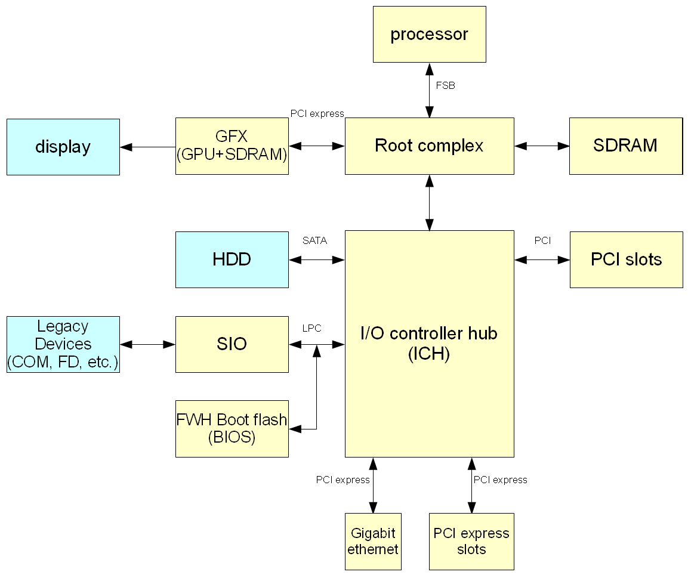
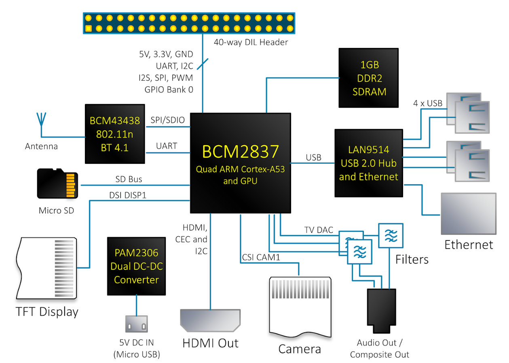
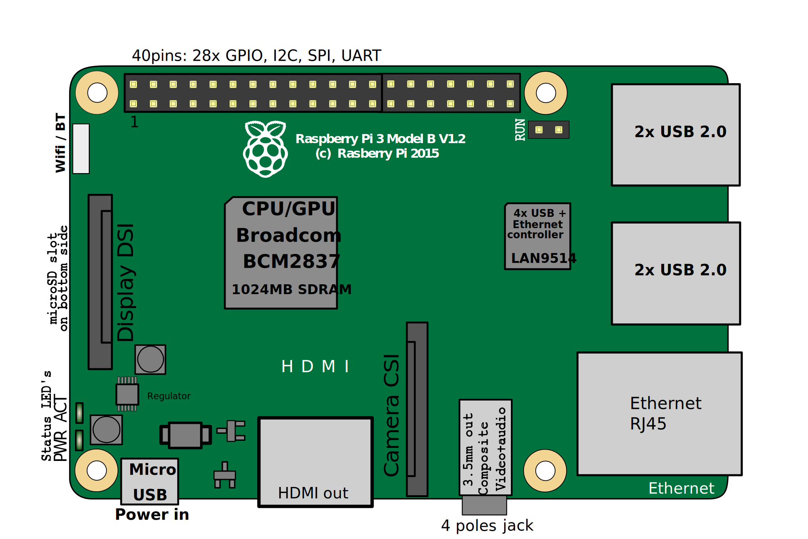

# Arquitectura y componentes de computadoras

## Arquitectura de una computadora

### x86

Diagrama de bloques de la arquitectura de una computadora x86

Anillos de protección x86

### Raspberry Pi

Diagrama de bloques de la arquitectura de una computadora Raspberry Pi

Componentes físicos de una computadora Raspberry Pi

### Relación entre hardware, espacio de kernel y espacio de usuario

- <https://en.wikipedia.org/wiki/Protection_ring>

--------------------------------------------------------------------------------

## Video de la clase

- <https://www.youtube.com/watch?v=nyeHbNPFAcA&list=PLa3Cxza-egQUPeSpVcPY0qXxDlaVkEiE7&index=2>

--------------------------------------------------------------------------------

## Videos complementarios

Lista de reproducción en YouTube:

- <https://tinyurl.com/SO-Ciencias-UNAM-Videos>
