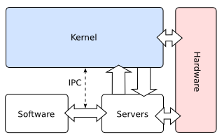

# Tipos de _kernel_

+ <https://wiki.osdev.org/Kernel>
+ <https://www.slideserve.com/isabelle-hopper/microkernels-virtualization-exokernels>
+ <https://techdifferences.com/difference-between-microkernel-and-monolithic-kernel.html>
+ <https://www.slideshare.net/hajimetazaki/linux-kernel-library-reusing-monolithic-kernel>

## Kernel monolítico

+ <https://wiki.osdev.org/Monolithic_kernel>

## Microkernel

+ <https://wiki.osdev.org/Microkernel>

## Kernel modular

+ <https://wiki.osdev.org/Modular_Kernel>

## Diferencias

Kernel monolítico vs microkernel

![https://image3.slideserve.com/7020606/monolithic-kernel-vs-microkernel-n.jpg]../../img/monolithic-kernel-vs-microkernel-n.jpg)

## Componentes del kernel

### Linux

+ <https://makelinux.github.io/kernel/map/>
+ <https://commons.wikimedia.org/wiki/File:Linux_kernel_diagram.png>
+ <https://www.tldp.org/LDP/sag/html/kernel-parts.html>
+ <https://www.linux-india.org/characteristics-and-architecture-of-linux-oprating-system/>
+ <http://www.mnis.fr/ocera_support/architecture/x531.html>
+ <http://www.dba-oracle.com/t_otn_7_linux_kernel.htm>
+ <https://www.ibm.com/developerworks/library/l-linuxuniversal/>
+ <https://en.wikipedia.org/wiki/History_of_Linux>
+ <https://en.wikipedia.org/wiki/Linux_kernel_version_history>
+ <https://en.wikipedia.org/wiki/List_of_Linux_distributions>
+ <https://learn.linksprite.com/pcduino/linux-applications/a-complete-historical-timeline-of-linux-evolution/>
+ <https://LinuxLifecycle.com/>
+ <https://linux.die.net/man/>

### Windows

+ <https://docs.microsoft.com/en-us/windows-hardware/drivers/kernel/overview-of-windows-components>
+ <https://blogs.msdn.microsoft.com/hanybarakat/2007/02/25/deeper-into-windows-architecture/>
+ <https://en.wikipedia.org/wiki/Windows_NT>
+ <https://en.wikipedia.org/wiki/Architecture_of_Windows_NT>
+ <https://en.wikipedia.org/wiki/Microsoft_Windows_version_history>
+ <https://en.wikipedia.org/wiki/Comparison_of_Microsoft_Windows_versions>

### Mac OS X, macOS, iOS, iPadOS

+ <https://en.wikipedia.org/wiki/Mach_%28kernel%29>

## Kernel space y User space

+ <https://drawings.jvns.ca/userspace/>

+ <https://caitlincomputerscience.wordpress.com/2015/10/15/kernel-space-vs-user-space/>
+ <https://www.slideshare.net/sureskal/linux-sk-v01>
+ <https://docs.microsoft.com/en-us/windows-hardware/drivers/gettingstarted/user-mode-and-kernel-mode>

## Llamadas al sistema

+ <https://en.wikipedia.org/wiki/System_call>

--------------------------------------------------------------------------------

## Video de la clase

- <https://www.youtube.com/watch?v=-P8iKoForGU&list=PLa3Cxza-egQUPeSpVcPY0qXxDlaVkEiE7&index=11>

--------------------------------------------------------------------------------

## Videos complementarios

Lista de reproducción en YouTube:

- <https://tinyurl.com/SO-Ciencias-UNAM-Videos>
