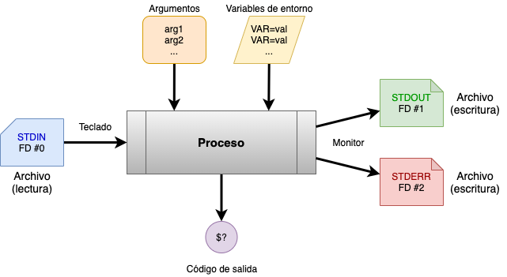

---
# https://www.mkdocs.org/user-guide/writing-your-docs/#meta-data
title: Elementos de entrada y salida de un programa
authors:
- Andrés Leonardo Hernández Bermúdez
---

# Elementos de entrada y salida de un programa

El sistema operativo da algunos elementos a los procesos cuando se ejecutan.

|          |
|:-------------------------------------------:|
| Elementos de entrada y salida en un proceso |

## Archivos abiertos

Se tienen de manera predeterminada tres archivos abiertos en un programa

1. Entrada estándar `STDIN` (lectura)
2. Salida estándar `STDOUT` (escritura)
3. Salida de errores `STDERR` (escritura)

### Entrada estándar: `STDIN`

Este archivo representa el teclado y se utiliza para leer datos desde la terminal.

También se puede utilizar para leer desde un archivo de entrada.

Tiene el descriptor de archivos número `0` y se abre en **modo lectura**.

### Salida estándar: `STDOUT`

Este archivo representa el monitor y se utiliza para escribir datos hacia la pantalla.

También se puede utilizar para escribir a un archivo de salida

Tiene el descriptor de archivos número `1` y se abre en **modo escritura**.

### Salida de errores: `STDERR`

Este archivo también escribe hacia el monitor, pero representa la salida de errores y escribe datos hacia la pantalla.

También se puede utilizar para escribir a un archivo de salida

Tiene el descriptor de archivos número `2` y se abre en **modo escritura**.

## Código de salida: `$?`

Indica si el programa fue exitoso o no:

| Condición del programa | Código de salida |
|:----------------------:|:----------------:|
| Éxito                  | Igual a `0`      |
| Fallo                  | Diferente de `0` |

Este código se regresa al final de la ejecución del programa y se puede especificar un valor entero para indicar diferentes estados de error.

La biblioteca `stdlib.h` define dos variables para indicar el éxito o fallo de un programa:

- `EXIT_SUCCESS`: `0`
- `EXIT_FAILURE`: `1`

El código de salida puede ser leído después de la ejecución de un programa utilizando la variable `$?` en el shell inmediatamente después de ejecutar el programa. En el siguiente ejemplo `true` y `false` son programas estándar de UNIX que se encuentran en el `PATH`.

```sh
$ true
$ echo $?
0

$ false
$ echo $?
1
```

## Elementos proporcionados por el shell

Cuando se invoca el programa, el shell puede proporcionar elementos adicionales al programa.

### Argumentos

Los argumentos de línea de comandos indican las opciones con las que se ejecutó el programa. Se representan de la siguiente manera en el programa en C:

```sh
$ programa argumento-1 argumento-2 ... argumento-n
```

#### Número de argumentos: `argc`

Se utiliza la variable de tipo entero `argc`.

Un proceso siempre tiene por lo menos un argumento que es el nombre del programa que se está elecutando y es representado por `argv[0]`, por lo que la variable `argc` siempre tendrá un valor mayor o igual a 1.

#### Valor de los argumentos `argv`

Se utiliza la variable de tipo arreglo de cadenas `char* argv[]`.

Esta variable puede ser leída como si hubiese sido declarada de la siguiente manera:

```c
char* argv[argc] = 
{
  "programa",
  "argumento-1",
  "argumento-2",
  /*	...		*/
  "argumento-n"
} ;
```

Cada cadena esta terminada por '\0', la longitud de la cadena se puede saber si se utiliza la función `strlen` incluida en la biblioteca `string.h`.

### Variables de entorno: `envp`

Las variables de entorno se definen de la siguiente manera en el shell:

- Crear una nueva variable de entorno que estará presente mientras se ejecute el shell.

```sh
$ export VARIABLE=valor
```

- Imprimir una variable de entorno presente en la sesión actual del shell.

```sh
$ printenv VARIABLE
valor

$ echo ${VARIABLE}
valor
```

- Pasar una variable de entorno adicional a un programa al momento de invocarlo.

```sh
$ VARIABLE=valor programa
```

- Borrar una variable de entorno previamente definida

```sh
$ unset VARIABLE
```

Se utiliza la variable de tipo arreglo de cadenas `char* envp[]`.

Esta variable puede ser leída como si hubiese sido declarada de la siguiente manera:

```c
char* envp[] = 
{
  "VARIABLE_1=valor",
  "VARIABLE_2=valor",
  /*	...		*/
  "VARIABLE_N=valor",
  NULL                /* Último elemento */
} ;
```

Cada cadena esta terminada por '\0', la longitud de la cadena se puede saber si se utiliza la función `strlen` incluida en la biblioteca `string.h`. El último elemento de este arreglo de cadenas es NULL.

Cada cadena representa el nombre de la variable y el valor que fue asignado, si el programa va a utilizar variables de entorno debe implementar algún mecanismo para separar el nombre de la variable de entorno de su valor, se puede utilizar la función `strtok` para dividir el nombre y valor de la variable de entorno o bien la función `getenv` si ya se conoce el nombre de la variable de entorno y únicamente se quiere acceder al valor.

--------------------------------------------------------------------------------

# Prototipos de función principal

Este prototipo de función principal indica que el programa no procesará argumentos de línea de comandos y tampoco procesará las variables de entorno.

```c
int main(void)
```

Este prototipo de función principal indica que el programa puede leer los argumentos de línea de comandos proporcionados por el shell.

```c
int main(int argc, char* argv[])
```

Este prototipo de función principal indica que el programa puede recibir los argumentos de línea de comandos y además acepta las variables de entorno que fueron proporcionadas por el shell.

```c
int main(int argc, char* argv[], char* envp[])
```

# Esqueleto de un programa

```c
#include <stdio.h>
#include <stdlib.h>
#include <strings.h>

int main(int argc, char* argv[], char* envp[])
{
  /* Inicializando buffer */
  size_t tamanio=64;
  char mensaje[tamanio];
  bzero(mensaje, tamanio);
  
  /* Leyendo y escribiendo en los archivos abiertos */
  printf("Escribe un mensaje:\n");
  scanf("%s", (char *) &mensaje);
  fprintf(stderr, "El mensaje fue:\t%s\n", mensaje);

  /* Leyendo los argumentos de entrada */
  for (int i=0 ; i<argc ; i++)
  {
    printf("Argumento # %d es:\t'%s'\n", i, argv[i]);
  }

  /* Leyendo las variables de entorno */
  for (int j=0 ; envp[j]!=NULL ; j++)
  {
    fprintf(stderr, "Variable de entorno # %d es:\t'%s'\n", j, envp[j]);
  }

  /* Código de salida */
  return EXIT_SUCCESS;
}
```
