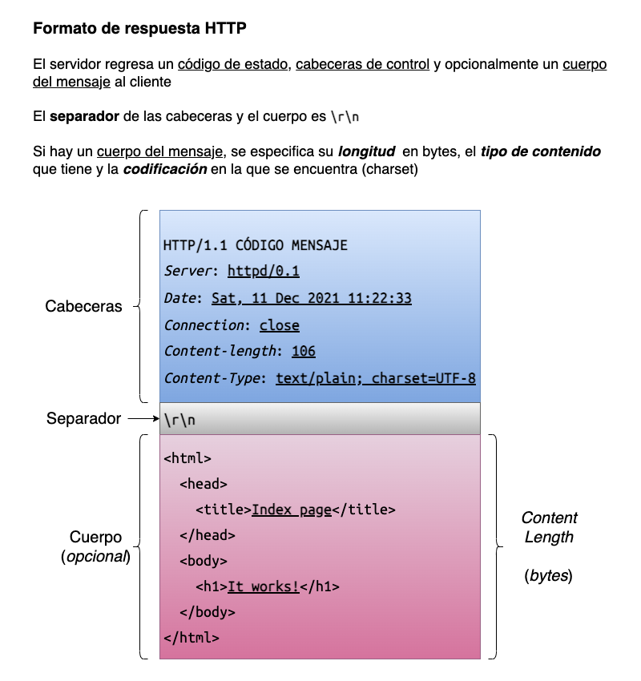
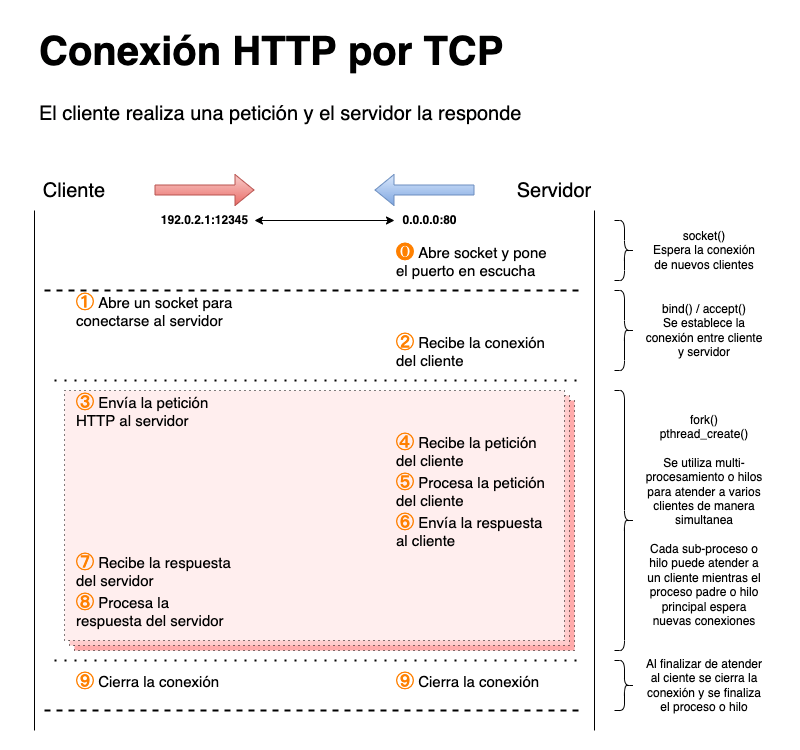

---
# https://www.mkdocs.org/user-guide/writing-your-docs/#meta-data
title: Protocolo HTTP
authors:
- Andrés Leonardo Hernández Bermúdez
---

# Protocolo HTTP

El protocolo HTTP es _basado en texto_, por lo que todas las peticiones y respuestas involucran el intercambio de mensajes _en texto_ entre el cliente y el servidor.

HTTP utiliza el protocolo TCP para comunicar al cliente con el servidor y el puerto predeterminado que usa es el 80, este puerto se encuentra en el [rango de _puertos bien conocidos_][wikipedia-well-known-ports] que da la IANA.

```sh
$ getent services http
http		80/tcp		www
```

## Formato de datos

### Petición

- Cada línea de las cabeceras se termina con `\r\n`
- Al final de las cabeceras se debe imprimir el separador `\r\n`

|  |
|:-----------------------------:|
| Formato de petición HTTP

### Respuesta

- Cada línea de las cabeceras se termina con `\r\n`
- Al final de las cabeceras se debe imprimir el separador `\r\n`

|  |
|:-----------------------------:|
| Formato de respuesta HTTP

## Métodos HTTP

| Método  | Cuerpo (petición)           | Cuerpo (respuesta)          | Descripción |
|:-------:|:---------------------------:|:---------------------------:|:------------|
| `HEAD`  | <span class="no">NO</span>  | <span class="no">NO</span>  | Solicita al servidor únicamente las cabeceras asociadas al recurso
| `GET`   | <span class="no">NO</span>  | <span class="yes">SI</span> | Solicita un recurso al servidor
| `POST`  | <span class="yes">SI</span> | <span class="yes">SI</span> | Envía datos al servidor

### Método `HEAD`

|  |
|:----------------------------:|
| Formato del método `HEAD` de HTTP

### Método `GET`

|  |
|:----------------------------:|
| Formato del método `GET` de HTTP

### Método `POST`

|  |
|:----------------------------:|
| Formato del método `POST` de HTTP

## Códigos de estado HTTP

Los [códigos de estado del protocolo HTTP][wikipedia-list-http-status-code] se dividen en varios grupos:

- `1xx` : Respuesta informativa
- `2xx` : Éxito
- `3xx` : Redirección
- `4xx` : Error del cliente
- `5xx` : Error del servidor

| Código de estado | Mensaje               | Descripción |
|:----------------:|:----------------------|:------------|
| 200              | OK                    | Se encontró el recurso y se regresa al cliente
| 204              | No Content            | Para la petición `HEAD` <br/> Se regresan las cabeceras del protocolo y no hay contenido
| 400              | Bad Request           | El cliente envió una petición mal formada al servidor
| 403              | Forbidden             | No se pudo acceder al recurso por falta de permisos para leer el archivo solicitado
| 404              | Not Found             | El archivo solicitado no existe
| 405              | Method Not Allowed    | Se intentó utilizar un método que el servidor no reconoce
| 500              | Internal Server Error | Cualquier otro error del servidor

## Cabeceras HTTP

Existe una [lista de cabeceras HTTP][wikipedia-list-http-headers]

| Cabecera            | Valores                          | Petición | Respuesta | Descripción |
|:-------------------:|:--------------------------------:|:--------:|:---------:|:------------|
| Host                | Nombre de host o IP (:puerto)    | **Si**   | No        | Establece el _virtual host_ al que se le envía la petición <br/> Se debe especificar el puerto si no es el estándar
| User-Agent          | Nombre del software del cliente  | **Si**   | No        | Menciona qué _software_ de cliente se está comunicando con el servidor web
| Server              | Nombre del sofrware del servidor |  No      | **Si**    | Menciona qué _software_ de servidor web atendió la petición del cliente
| Date                | _fecha_                          |  No      | **Si**    | Establece la fecha en la que la petición fue respondida
| E-Tag               | _entero_                         |  No      | **Si**    | Establece un valor asociado al archivo
| Connection          | Close                            |  **Si**  | **Si**    | Establece una preferencia para cerrar la conexión después de que la petición fue atendida
| Content-Type        | tipo/mime; charset=UTF-8         |  No      | **Si**    | Establece el tipo de contenido que se está regresando al cliente y la codificación que maneja
| Content-Length      | (bytes)                          |  No      | **Si**    | Menciona el tamaño del cuerpo en la respuesta HTTP
| Content-Disposition | inline<br>attachment             |  No      | **Si**    | Establece si el contenido se debe mostrar (_inline_) u ofrecer para que el cliente lo descargue (_attachment_)

## Tipos de contenido

Para más información, consultar la [lista extensiva de tipos MIME][mime-content-type-page] o esta [página de referencia rápida][mime-content-type-page].

| Extensión    | Tipo de archivo  | Tipo de contenido MIME     | Cabeceras adicionales |
|:------------:|:----------------:|:--------------------------:|:----------------------|
| .txt         | Texto plano      | `text/plain`               | Especificar `charset=UTF-8` en `Content-Type`
| .htm , .html | Página HTML      | `text/html`                | Especificar `charset=UTF-8` en `Content-Type`
| .css         | Hoja de estilo   | `text/css`                 | Especificar `charset=UTF-8` en `Content-Type`
| .js          | Script JS        | `text/javascript`          | Especificar `charset=UTF-8` en `Content-Type`
| .jpg , .jpeg | Imagen JPEG      | `image/jpeg`
| .png         | Imagen PNG       | `image/png`
| .gif         | Imagen GIF       | `image/gif`
| .bmp         | Imagen BMP       | `image/bmp`
| .tif , .tiff | Imagen TIFF      | `image/tiff`
| .svg         | Imagen SVG       | `image/svg+xml`            | Especificar `charset=UTF-8` en `Content-Type`
| (_otro_)     | binario          | `application/octet-stream` | `Content-Disposition: attachment`

## Conexión HTTP con sockets TCP

|  |
|:---------------------------------:|
| Funcionamiento de la conexión TCP para el protocolo HTTP

[wikipedia-well-known-ports]: https://en.wikipedia.org/wiki/List_of_TCP_and_UDP_port_numbers#Well-known_ports
[mime-content-type-iana]: https://www.iana.org/assignments/media-types/media-types.xml
[mime-content-type-page]: https://mimetype.io/
[wikipedia-list-http-status-code]: https://en.wikipedia.org/wiki/List_of_HTTP_status_codes
[wikipedia-list-http-headers]: https://en.wikipedia.org/wiki/List_of_HTTP_header_fields
