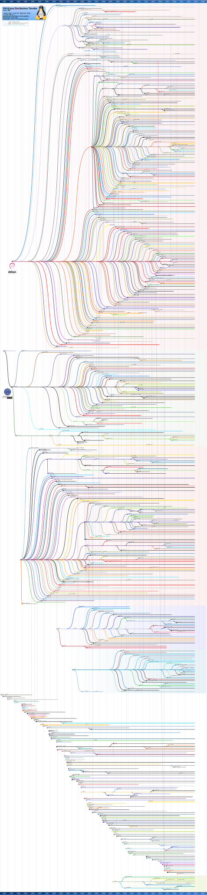

# Historia de los sistemas operativos

## UNIX

- <https://en.wikipedia.org/wiki/Unix>
- <https://www.graphviz.org/Gallery/directed/unix.html>

## Linux

- <https://en.wikipedia.org/wiki/List_of_Linux_distributions>

--------------------------------------------------------------------------------

## Video de la clase

- <https://www.youtube.com/watch?v=-P8iKoForGU&list=PLa3Cxza-egQUPeSpVcPY0qXxDlaVkEiE7&index=11>

--------------------------------------------------------------------------------

## Videos complementarios

Lista de reproducción en YouTube:

- <https://tinyurl.com/SO-Ciencias-UNAM-Videos>
